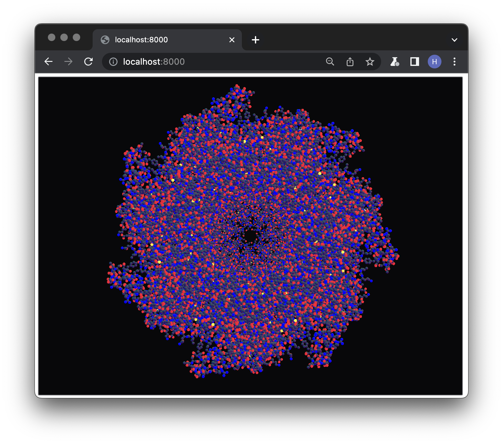

# WebGPU in Rust

This project uses WebGPU implementation in Rust - [wgpu](https://github.com/gfx-rs/wgpu) to implement a simple framework that is capable of rending protein molecules both on native and the web (WebAssembly). The project also aims to benchmark the API's maturity and performance and see if it is adequate for large molecule rendering.

## Setup

The project is currently built with Rust version `1.59.0`.
Setup instructions:

1. Install `rustup` - Rust toolchain management: [rustup.rs - The Rust toolchain installer](https://rustup.rs/#), this should also install all necessary tools for building `rustc` - Rust compiler and `cargo` - Rust package manager.

2. The large `.pdb` files are, for obvious reasons, not included in the repo; you will have to download them manually from the [archive](https://www.rcsb.org/structure/1AON) and put them into `src/molecules` folder.

3. Build and run the application with `cargo run`.

## Build status

Currently, the project can be built and run on these platforms:

- macOS Monterey

- Ubuntu 20.04

- Windows 10

- Chrome Canary 102.0.4972

- (Electron v20.0.0-nightly.20220330)

Note:
Running in Firefox Nightly fails due to Firefox's outdated shader syntax (Chrome Canary has recently abandoned the old wgsl syntax completely).

## Demo

## Building for the web

To target web browsers, Rust code needs to be compiled to [WebAssembly](https://webassembly.org/), a common language supported by browsers. For this purpose, we use `wasm32-unknown-unknown` as target and use crate `wasm-bindgen` that generates the needed JavaScript glue. Finally, we set up a simple web server that will host our application, which uses `index.html` as an entry point to our WebAssembly bytecode. To put in simple steps:

> Alternatively, you can use `scripts/build-web.sh` script to run the following five commands for you.

1. Add wasm compilation target: `rustup target add wasm32-unknown-unknown`

2. Compile to wasm: `cargo build --target wasm32-unknown-unknown`

3. Install `wasm-bindgen` for generating JS glue: `cargo install -f wasm-bindgen-cli`

4. Generate JS glue: `wasm-bindgen --out-dir target/generated/ --web target/wasm32-unknown-unknown/debug/visitlab-wgpu.wasm`

5. Host the application: `python3 -m http.server` (you can use any other http server implementation, although it is important to run the server on port `8000`, see `parser.rs` for detailed information).

6. The application should be accessible at `http://localhost:8000/` in a browser with WebGPU support (e.g., Chrome Canary).

## Building Electron Application

Building the Electron Application requires `Node.js`, which can be downloded from <https://nodejs.org/en/download/>.

> Alternatively, you can use `scripts/build-electron.sh` script to run the following five commands for you.

1. Build and host the web application either manually as described amove in **Building for the web** section or using `scripts/build-web.sh` script.
2. In a new terminal window navigate to `src/electron` and run `npm i` to install Electron dependencies.
3. Run `npm start` to run the Electron application.

## Checkpoints

- [x] basic rendering pipeline setup
- [x] parse molecule file into data for shader
- [x] render atoms using `wgsl` sphere impostor quad shader
- [x] compilation for web browsers
- [x] fix depth buffer quad clipping
- [x] fix window resizing in browser
- [x] electron build
- [x] add docs for electron build
- [ ] fix console warnings in browser
- [ ] fix colors in web build
- [ ] profile both native and web build
- [ ] implement simple GUI in electron
- [ ] implement proper lighting in the shader
- [ ] use depth buffer texture in the shader to visualize depth
- [ ] sticks and balls rendering shader
