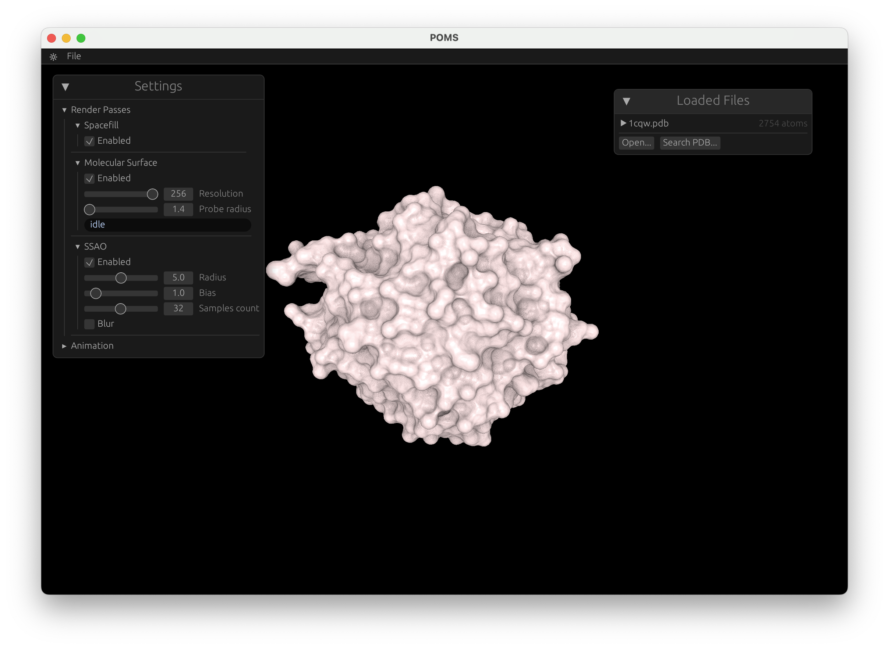

# POMS - Portable Molecular Surface

An implementation of [Molecular Surface](https://en.wikipedia.org/wiki/Accessible_surface_area) generation and rendering, following the approach by Hermosilla et al. \[1]. It is designed to be highly portable across platforms through the use of [`wgpu`](https://github.com/gfx-rs/wgpu). In addition to molecular surface visualization, the application also offers a simpler space-filling model for molecules and basic post-processing.

\[1\]  *Hermosilla, Pedro, et al. "Interactive GPU-based generation of solvent-excluded surfaces." The Visual Computer 33.6 (2017): 869-881.*

## Screenshots



## Requirements

- Rust toolchain (recommended installation via [rustup.rs](https://rustup.rs/#)).

> The Minimum Supported Rust Version (MSRV) is defined in `rust-toolchain.toml`. Should match the MSRV required by `wgpu`.

## 🛠️️ Building (MacOS, Windows)

```bash
cargo run
```


### Features

- `no-vsync`: uncaps the FPS, useful for performance testing:

    ```bash
    cargo run --features no-vsync
    ```

> For optimal performance, also include the `--release` flag.

## ️🌐 Building for the Web

To build the application for the web, we use [`Trunk`](https://trunkrs.dev), a tool for building WebAssembly (WASM) applications in Rust.

First install `Trunk` (if you haven't already):

```bash
cargo install --version ^0.16 trunk
```
> This might take a few minutes as it is built from source.

After that, to build the application for the web, run:

```bash
trunk build --release
```

This will generate a `dist` directory with the necessary files to host the application on a web server.

Alternatively, to build and run the application on a local web server, run:

```bash
trunk serve --release
```

which installs [`Trunk`](https://trunkrs.dev) and runs it with necessary configuration. This should build our WASM code and start a web server that hosts the application at `localhost:8080`.

#### What happens behind the scenes?

`Trunk` takes care of several things, which would have to be done manually otherwise:

- Builds our Rust code to WASM bytecode using `wasm32-unknown-unknown` platform target, generating a `.wasm` file.
- Optimizes the WASM code using `wasm-opt`.
- Generates necessarry glue between WASM and JavaScript using [wasm-bindgen](https://rustwasm.github.io/docs/wasm-bindgen/), generating a `.js` file.
- Compiles an `index.html` file that loads the WASM code and JavaScript glue.
- Places all generated files in `dist` directory (you may use `--dist` argument to change the output directory).
- Starts a simple dev web server that hosts the application from this directory (in case of `trunk serve`).

## 🐧 Building on Linux

On linux, you might need to install some additional supporting libraries to build and run. On `Ubuntu 22.04`, the following packages are required:

```bash
sudo apt install libgtk-3-dev libglib2.0-dev libssl-dev
```