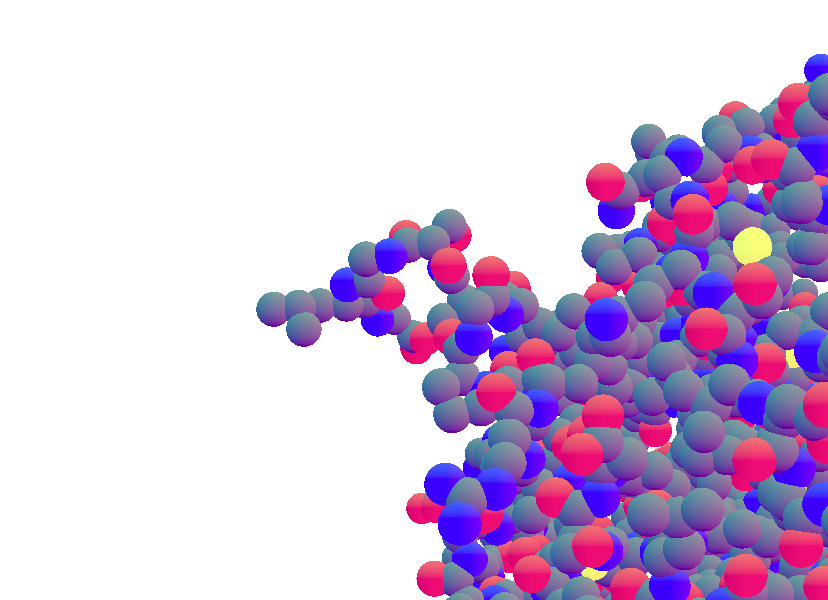
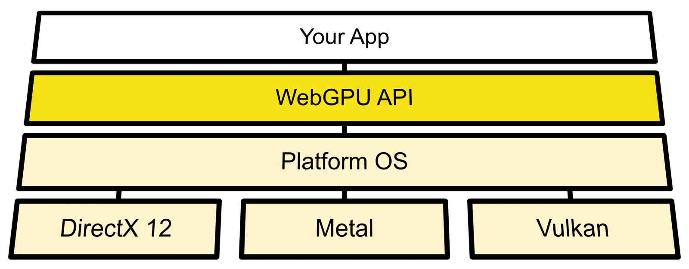
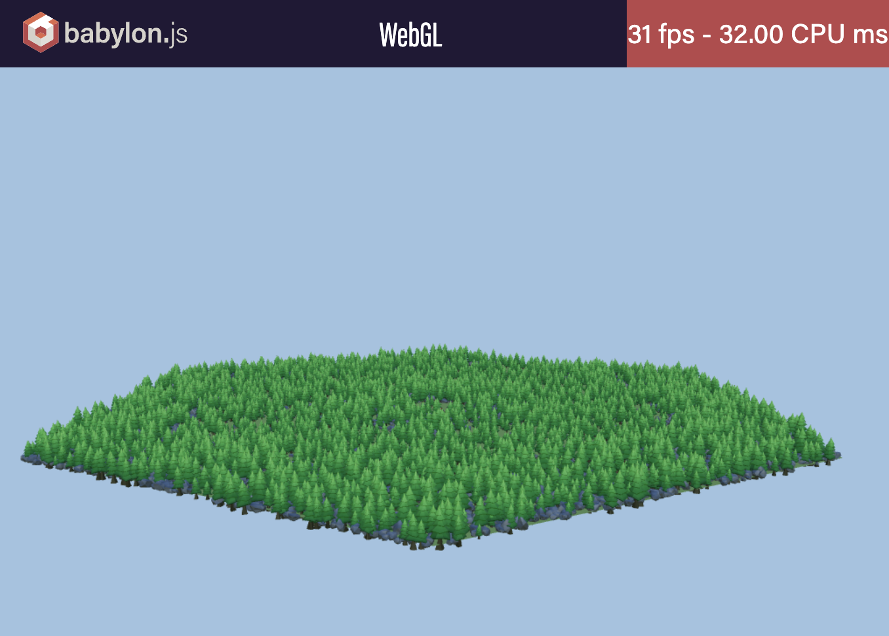
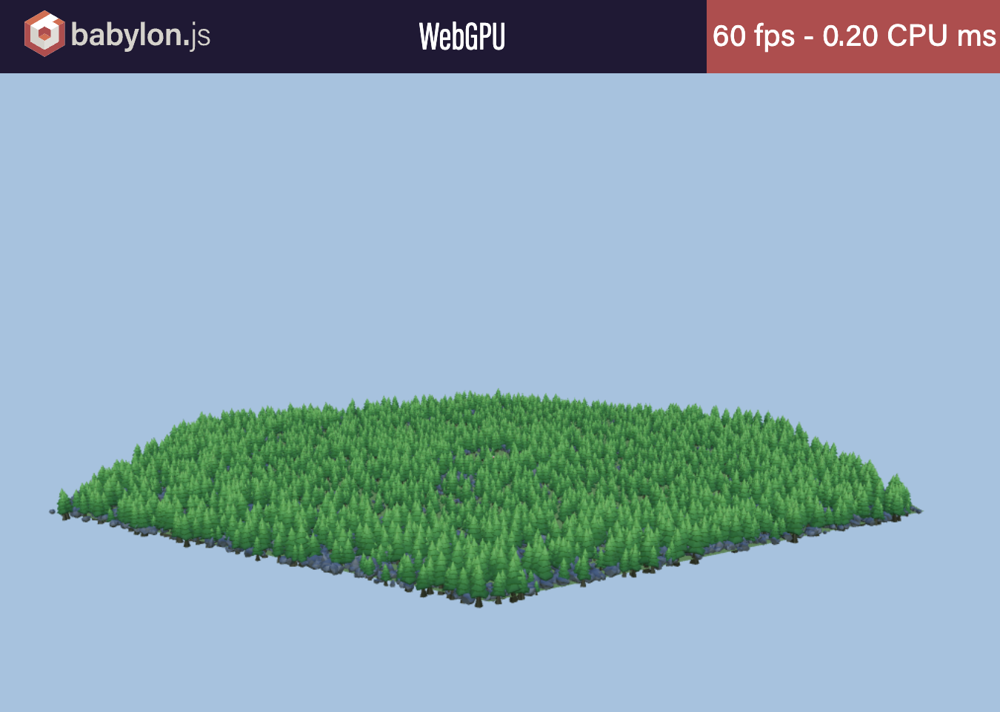
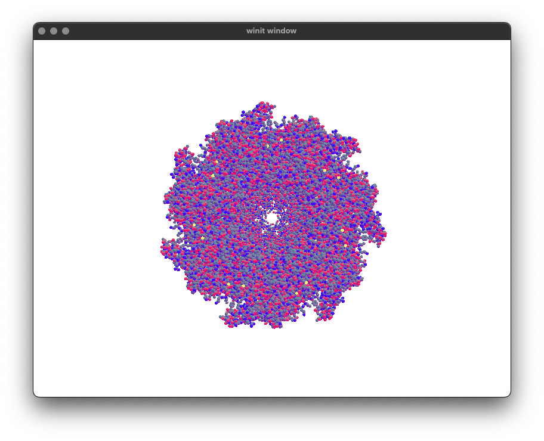
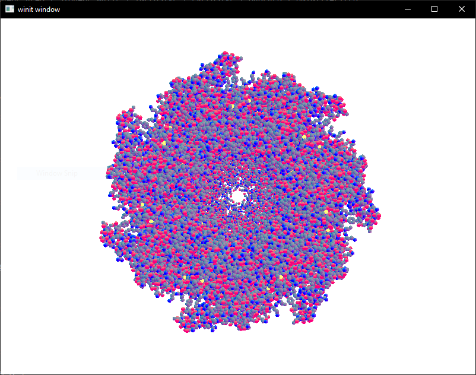
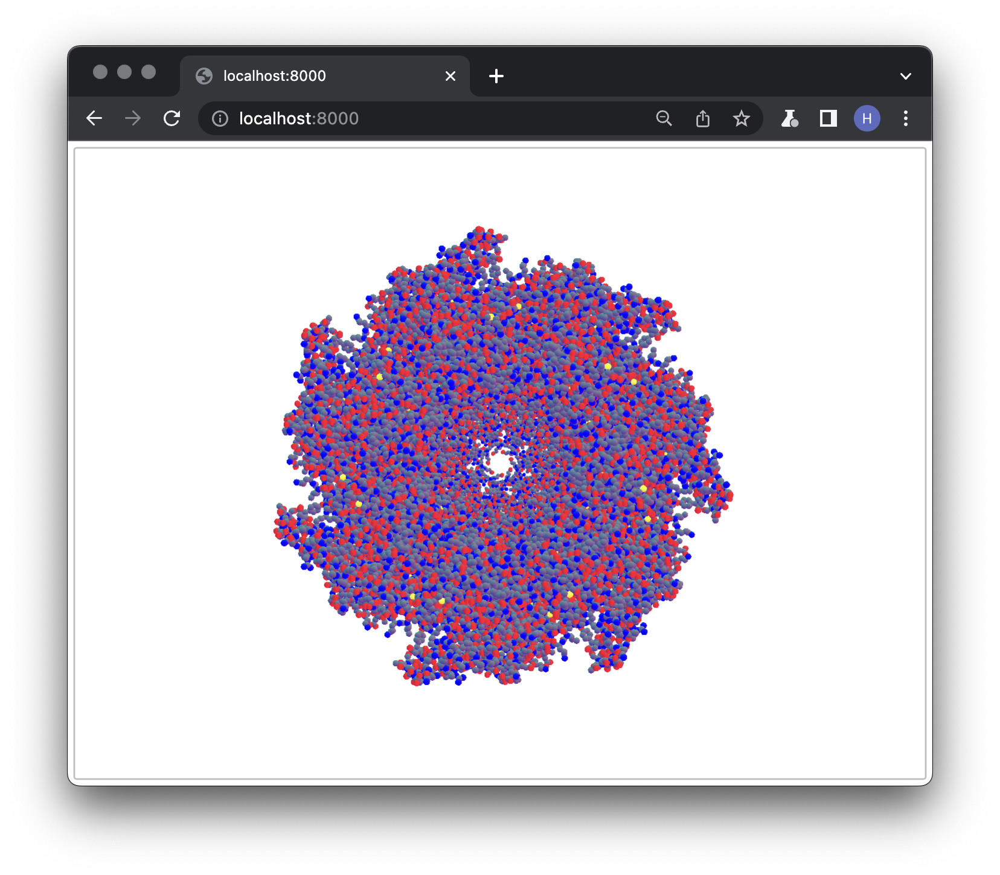
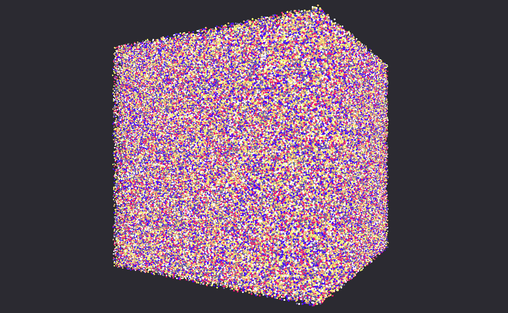

## [PV160] - Rendering Molecules with WebGPU

### Hugo Adamove

#### Supervisor: RNDr. Jan Byška, Ph.D

---

# Goal

- Research the state of the art cross-platform 3D rendering tools, namely WebGPU
- Learn a lot of new things about web browsers, Rust, WebAssembly
- Render protein molecules in the browser

---

# Cross-platform applications

- Multiple platforms, one codebase
- Java applications that run in JVM
- Nowadays, **web browsers** provide a uniform "sandbox" across most platforms
- Electron JS (Discord, MS Teams, VS Code)

---

# WebGPU

- As of now, most of the 3D on the web uses **WebGL** (do not confuse it with WebGPU!)
- **WebGPU** - Modern API for rendering in the browser, "successor" to WebGL
- Allows **general-purpose** usage of the GPU (e.g., compute shaders)
- Currently only available in developer versions of browsers or under feature flag (Chrome Canary, Firefox Nightly, Safari)

---

# Architecture of WebGPU

---

# WebGL vs WebGPU

|  |  |
| --------------------------- | ---------------------------- |

<https://www.babylonjs.com/demos/webgpu/forestwebgpu>

---

# Rendering molecules in the browser (not only!)

- One codebase in Rust
- Compiled into **WebAssembly** for browsers
- Runs in Chrome Canary, Firefox Nightly, Electron
- Runs natively on Windows, Linux, macOS

---

# Application demo

- Simple camera to move around
- Basic event system
- Simple shading
- Atoms rendered using sphere impostors

---

# Running Cross-platform

|  |  |  |
| -------------- | ------- | ------------- |
| macOS (native) | Windows (native) | Chrome Canary |

---

# Performance Test

- $10^6$ atoms ( $6*10^6$ vertices) yields 30-40 fps  on native
- 2-3x slower in the browser

---

# Plans for the rest of the semester

- Benchmarking, profiling
- Experiment with UI (modern CSS, React)

